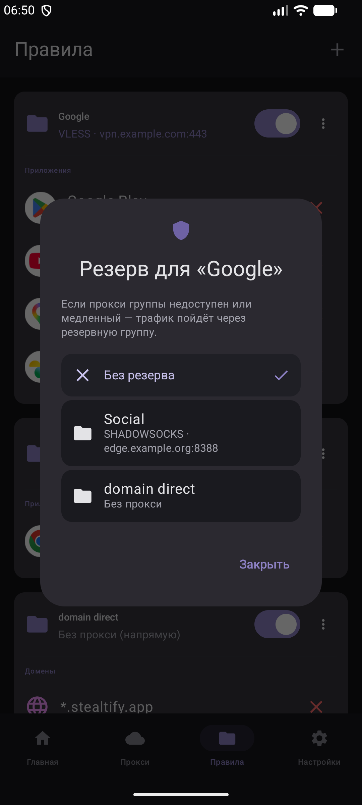
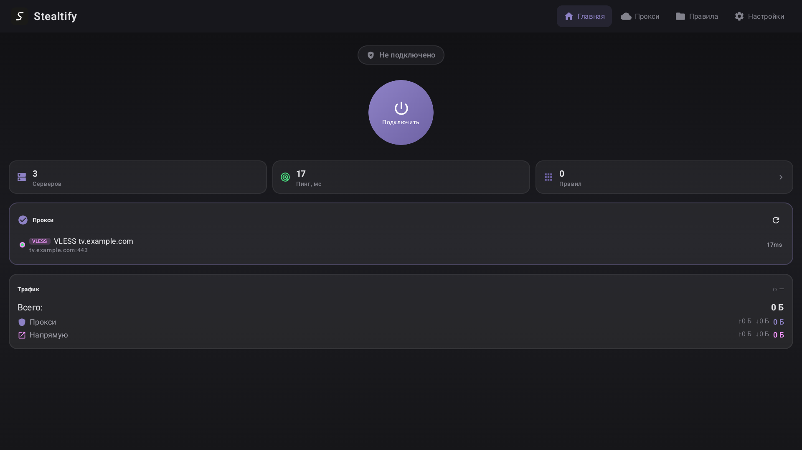

<p align="center">
  
</p>

<p align="center">
  <b>Route each app's traffic through its own proxy. No root.</b>
</p>

<p align="center">
  <a href="https://github.com/stealtify/stealtify/releases/latest"></a>
</p>

<p align="center">
  <a href="#features">Features</a> •
  <a href="#how-it-works">How it works</a> •
  <a href="#installation">Installation</a> •
  <a href="#usage">Usage</a> •
  <a href="#-android-tv">Android TV</a> •
  <a href="#documentation">Documentation</a>
</p>

<p align="center">🌐 <a href="https://stealtify.app">stealtify.app</a> · 📥 <a href="https://update.stealtify.app">update.stealtify.app</a> · 🇷🇺 <a href="./README.ru.md">Русская версия</a></p>

<p align="center">
  
  &nbsp;
  
</p>

<p align="center"><sub>Left: a group's fallback — if the group's proxy is down or slow, traffic goes through the backup group. Right: the Android TV build. Interface language: Russian.</sub></p>

---

## Features

### Routing

- 🎯 **Per-app routing** — assign different proxies to different apps
- 🌐 **Domain rules** — from DNS answers and TLS SNI
- 🔍 **UID identification** — precise app detection via `getConnectionOwnerUid()` (Kotlin, not a JNI callback)
- ♥️ **Failover & health check** — automatic proxy monitoring and switching
- 🔒 **Kill Switch** — in-app protection while the tunnel is being restored; for an OS-level guarantee, enable Always-on VPN

### Protocols and import

- 🔗 **8 protocols** — SOCKS5, HTTP CONNECT, SSH, VLESS, VMess, Trojan, Shadowsocks, AmneziaWG
- 🚀 **Dual engine** — Kotlin TCP/UDP stack (SOCKS5, HTTP CONNECT) + Go engine (xray-core for VLESS/VMess/Trojan, plus SSH, Shadowsocks, AmneziaWG)
- 📥 **URI import** — `vless://`, `vmess://`, `trojan://`, `ss://`, `socks5://`, `http://`, `ssh://`, `awg://`, `vpn://` links
- 📷 **QR import** — scan QR codes with proxy configuration
- 🔗 **Share proxy** — QR code and copy link to clipboard

### DNS and security

- 🔐 **Encrypted DNS (DoT/DoH)** — with presets for Cloudflare, Google, AdGuard, Quad9
- 🚫 **DNS filtering** — built-in list of blocked domains, off by default
- ✅ **Authenticity check** — every release is signed and verified on startup; counterfeit builds are rejected

### Device and interface

- 🔋 **No root** — works on stock Android 10+ through the VpnService API
- ♻️ **Auto-start** — launch the VPN on device boot
- 📊 **Monitoring** — connection logs, real-time traffic statistics
- 📱 **Material You** — modern UI on Jetpack Compose + Material 3
- 📺 **Android TV** — separate build (see below)
- 🇷🇺 **Interface language: Russian**

## Requirements

- Android 10+ (API 29+)
- Architecture: phone — arm64-v8a; Android TV build — arm64-v8a / armeabi-v7a / x86
- No root required

## How it works

```
App (YouTube) → VpnService TUN → Kotlin TunPacketProcessor
    → getConnectionOwnerUid() → "com.google.android.youtube"
    → Rule: YouTube → SOCKS5 proxy1:1080
    → Traffic is routed through proxy1

App (Chrome) → VpnService TUN → Kotlin TunPacketProcessor
    → getConnectionOwnerUid() → "com.android.chrome"
    → No rule found → default proxy

App in a group with no proxy assigned
    → Direct (bypasses the VPN interface entirely)
```

1. **VpnService** creates a TUN interface, capturing all device traffic
2. **Kotlin TunPacketProcessor** parses every TCP/UDP connection
3. The service identifies the app via `getConnectionOwnerUid()`
4. **RouteResolver** looks up a rule (app → domain → default proxy)
5. If a rule matches → traffic goes through that rule's proxy (or direct, if the rule's group has no proxy)
6. If no rule matches → traffic goes through the default proxy

## Installation

1. Download the latest APK from [Releases](../../releases)
2. Install it on a device running Android 10+
3. Confirm the VPN permission

Step-by-step instructions and checksum verification: **[docs/INSTALL.md](./docs/INSTALL.md)**.
Full end-user manual: **[docs/USER_GUIDE.md](./docs/USER_GUIDE.md)**.

## Usage

### 1. Add a proxy

**Proxies** → **+** → configure (or import a URI: `vless://...`, `ss://...`)

### 2. Create rules

**Rules** → pick an app → assign a proxy

### 3. Connect

Tap **Connect** on the Home screen.

## Supported protocols

| Protocol | Auth | UDP |
|----------|------|-----|
| SOCKS5 | ✅ user:pass | ✅ (UDP ASSOCIATE) |
| HTTP CONNECT | ✅ Basic | ❌ |
| SSH Tunnel | ✅ password | ✅ |
| VLESS (+ Reality, XTLS-Vision) | ✅ UUID | ✅ (xray-core) |
| VMess | ✅ UUID | ✅ (xray-core) |
| Trojan (+ Reality) | ✅ password | ✅ (xray-core) |
| Shadowsocks | ✅ password | ✅ (Go engine) |
| AmneziaWG | ✅ privateKey | ✅ (amneziawg-go) |

## FAQ

**Q: Is root required?**
A: No. It uses the standard Android VpnService API.

**Q: Can it run alongside another VPN?**
A: No. Android allows only one active VPN.

**Q: How is the app that owns a packet identified?**
A: Through `ConnectivityManager.getConnectionOwnerUid()` (API 29+).

**Q: What happens to apps without rules?**
A: They go through the default proxy. To send an app directly, put it in a group without a proxy.

**Q: Does the app send telemetry?**
A: No analytics SDKs and no account. It contacts the update server, ipapi.co (country for the External IP tile, directly), IP-echo services during server tests (through the proxy), and your subscription/DNS servers. See USER_GUIDE.md §10.

## 📺 Android TV

Stealtify also ships an Android TV build, as a separate package `com.stealtify.app.tv`.

Status: **beta** — expect rough edges; see the TV guides.

- Four APKs: arm64-v8a, armeabi-v7a, x86, and a universal fallback.
- Top-bar UI redesigned for D-pad navigation instead of touch.
- Import configuration from your phone over the local network — no QR scanner and no
  Quick Settings tile on the TV build (Android TV has no camera or notification shade).

Guides: [docs/tv/TV_INSTALL.md](./docs/tv/TV_INSTALL.md) · [docs/tv/TV_USER_GUIDE.md](./docs/tv/TV_USER_GUIDE.md)

## Documentation

| Document | Description |
|----------|-------------|
| [📥 Install](./docs/INSTALL.md) | Installation and checksum verification |
| [📚 User guide](./docs/USER_GUIDE.md) | Full end-user manual |
| [📺 Android TV](./docs/tv/TV_INSTALL.md) | TV build install & guide |
| [🛠 Troubleshooting](./docs/TROUBLESHOOTING.md) | Common problems and fixes |
| [🔒 Privacy policy](./docs/PRIVACY.md) | What the app connects to, and what it doesn't |
| [📋 Roadmap](./docs/ROADMAP.md) | What's shipped and what's planned |
| [📝 Changelog](./CHANGELOG.md) | Release history |
| [⚖️ Third-party licenses](./docs/LICENSES.md) | Dependency licenses |

## License

Proprietary license (EULA) — Copyright © 2025–2026 Stealtify. All rights reserved.
See [LICENSE](./LICENSE). Third-party components (MPL-2.0 / Apache-2.0 / BSD / MIT)
keep their own licenses — see [NOTICE](./NOTICE) and [docs/LICENSES.md](./docs/LICENSES.md).

---

<div align="center">

📥 [Install](./docs/INSTALL.md) · 📚 [User guide](./docs/USER_GUIDE.md) · 📋 [Roadmap](./docs/ROADMAP.md) · 🔒 [Privacy](./docs/PRIVACY.md)

<sub>Made with ❤️ for privacy and freedom</sub>

</div>
